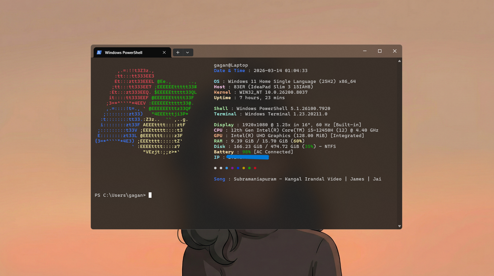

# Fastfetch Config


Minimal Windows Fastfetch setup using a Catppuccin-inspired theme.

## Preview



## Info

* **OS:** Windows 11
* **Terminal:** Windows Terminal
* **Font:** Cascadia Mono
* **Theme:** Catppuccin (custom)

## Install

```bash
git clone https://github.com/Gagandeeprai/fastfetch-config
```

Copy `config.jsonc` to:

```
C:\Users\YOUR_USERNAME\.config\fastfetch
```
